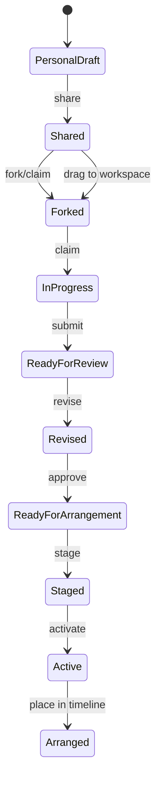

# Product State Model

## Top-level domains (custom — not library-defined)

```text
Session
├── Participants[]          # identity, color, presence
├── TaskProfiles[]          # workspace presets (MIDI, Mix, Arrange…)
├── Assignments[]           # participant ↔ current task (mutable)
├── Clips[]                 # musical artifacts + revisions
├── ExchangeQueue[]         # public handoffs
├── Arrangement             # staged + active clip slots on timeline
├── SharedMaster            # transport, mix, bleed, output
├── PresenterView           # global | participant(id) | follow
└── LiveControlDock         # 8 slots, bindings, sync state
```

## Clip state machine



## Presenter viewpoint (projection only)

| Mode | Renders | State mutation |
|------|---------|----------------|
| `global` | Exchange + arrangement + presence | None |
| `participant(id)` | Full workspace for id | None |
| `follow` | Tracks `activeParticipantId` | None |

## Audio routing state

| Flag | Effect |
|------|--------|
| `previewClipId` | Routes to private cue bus |
| `captureAutomation` | Records param moves to clip automation |
| `sharedMasterActive` | Staged/active clips feed master graph |
| `workspaceBleed` | off \| low \| full |

## Live Control Dock slot

```typescript
interface DockSlotState {
  slotIndex: 0..7;
  controlType: 'knob' | 'fader' | 'toggle' | 'momentary';
  sourceRef: ParamRef | null;  // device/track/clip param
  value: number;
  syncEcho: boolean;           // suppress feedback loops
}
```

## Queue entry (visible on Exchange)

- `clipId`, `revision`, `creatorId`, `contributorId`
- `requestedAction`: review | revise | arrange | mix
- `status`: open | claimed | blocked | done
- `lineageParentId` for fork graph

## Internal adapter (hidden)

`SceneDefinition` from public pack → maps to arrangement boundaries and mix snapshots. No `Scene` label in UI.

## Domain events (Sol — accepted for Phase 3+)

UI and commands dispatch facts; reducers project views. Tone callbacks append boundary-execution facts only.

```
ClipRevisionCreated | ClipPreviewStarted | ClipOffered | ClipAccepted
PlacementQueued | PlacementCommittedAtBoundary | MixControlChanged
ControlPinned | ParticipantTaskProfileChanged
```

XState reserved for: audio permission, MIDI connection, export jobs — not per-clip actors.

See `design-research/strong-model-synthesis.md`.
